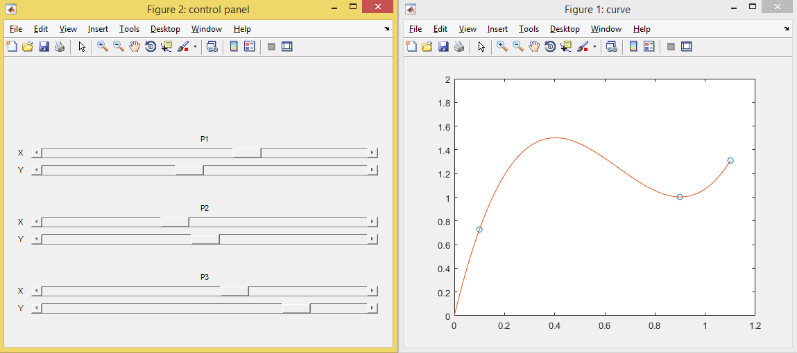

# thrustCurveGenerator

This matlab program generates a thrust curve profile by interpreting a spline from a list of defined points.



## TODO

- [x] refactor adding titles (see addBarTitles)
- [] further refactor adding titles using loops
- [] refactor declaring control points + interface
- [] document how to add more ports
- [] create export button
- [] add ability to adjust min and max of sliders (buttons maybe?)


## Code Notes

*Position* - used in `uicontrol` to denote the position and width of the object in question

``` matlab
{ 'Position', [ xpos, ypos, width, height]}

%example
uicontrol('Style','slider',...
		'Position',[40,250,500,15],...
        'value', 0.5, 'min',0, 'max',1); 
```